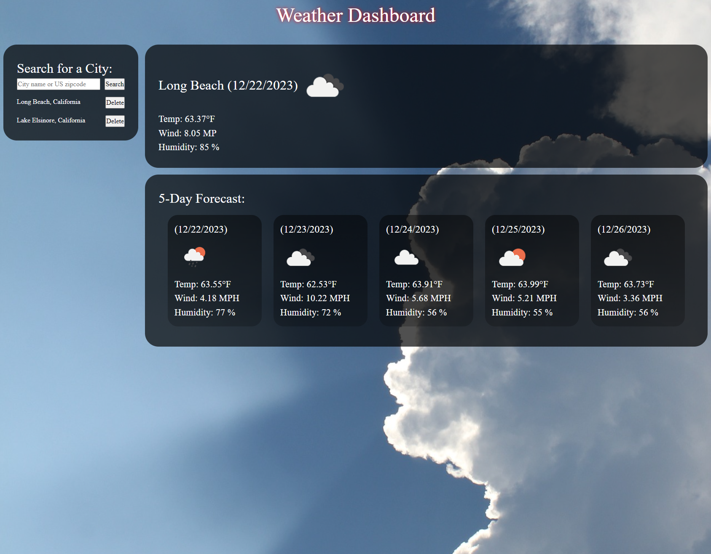

# Title Weather Dashboard

## Description

A weather application that provides current weather information and a 5-day forecast for a location in the United States.

## Deployed Application

Click [here](https://sareacct91.github.io/Weather-Dashboard/) to access the deployed application.

## Usage

1. Search for a Location:

    Type the name of a city or a zip code into the search bar and press Enter or click search

2. View Current Weather:

    The current weather details, including temperature, wind speed, and humidity, will be displayed.

3. 5-Day Forecast:

    Scroll down to view the 5-day weather forecast.

4. Additional Notes:

    The app is designed for U.S. locations only.

## Features

- **Search Location:** Type in the name of a city or a zip code to get weather information.
- **Current Weather:** View the current temperature, weather conditions, and other relevant details.
- **5-Day Forecast:** Plan ahead with a 5-day weather forecast.

## Technologies Used

> OpenWeatherMap API